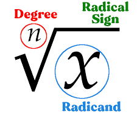

# Similar Polygons

We have previously learned that polygons are congruent if and only if all of their corresponding parts are congruent. Polygons are **similar** if and only if all of their corresponding _angles_ are congruent and all of their corresponding _sides_ are **proportional**.

$$
\triangle{ABC} \sim{} \triangle{DEF} \\ \therefore{\angle{A}\cong{}\angle{D}}, \\ \therefore{\angle{B}\cong{}\angle{E}}, \\ \therefore{\angle{C}\cong{}\angle{F}}, \\ \therefore{\frac{AB}{DE}=\frac{BC}{EF}=\frac{AC}{DF}}
$$

## Ratio Proportionality

<i class="fa-note">:note:</i> <a data-footnote-ref href="#user-content-fn-1">Congruent Height Proportionality Theorem</a>

If two triangles have the same height, then the ratio of their _bases_ is equivalent to the ratio of their _areas_.

<i class="fa-note">:note:</i> Triangle Proportionality Theorem

A line which meets two sides of a triangle divides those sides proportionally if and only if it is parallel to the third side.

<figure><figcaption></figcaption></figure>

<i class="fa-note">:note:</i> Angle Bisector Theorem

If an angle bisector is drawn in a triangle, it divides the opposite side such that the pieces are proportional to the other two sides.

### Proportions

An equation is a **proportion** if and only if it states that two ratios are equivalent. Assuming we know that...

$$
\frac{a}{b}=\frac{x}{y}
$$

The following are true...

* The **means** and **extremes** of the proportion are below.
  * $$b$$ and $$x$$ are the means of the proportion.
  * $$a$$ and $$y$$ are the extremes of the proportion.
* Multiply the means together, multiply the extremes together, and set the two products to be equivalent to each other. Solve for the desired variable; the solutions for all four are below.
  * $$a=\frac{bx}{y}$$
  * $$b=\frac{ay}{x}$$
  * $$x=\frac{ay}{b}$$
  * $$y=\frac{bx}{a}$$


The means and extremes of a proportion can flip, as long as they are [on opposite sides of the fraction bar from each other](#user-content-fn-2)[^2].


### The Geometric Mean

A constant, $$x$$, is the geometric mean of two numbers, $$a$$ and $$b$$, if and only if $$\frac{x}{a}=\frac{b}{x}$$. it is essentially the square root of their product: $$x=\sqrt{ab}$$.


If either of the extremes is a perfect square, the geometric mean of the extremes will be $$\sqrt{a}\sqrt{b}$$, assuming you simplify the perfect square.


### Scale Factors

A constant is the **scale factor** of two similar polygons if and only if it is the ratio of any pair of corresponding side lengths.

## Radicals

Radicals are the _inverse_ of exponents.

<figure><figcaption>
<strong>Image 1</strong> — The parts of a radical.
</figcaption></figure>

The **radical sign** is the actual √. The **radicand** is the number under the radical symbol. The **index** is the small superscripted number.

The index tells what exponentiation base to find. For example, if it is attempted to solve for  $$\sqrt[3]{8}$$, the answer would be 2, as $$2*2*2=2^3=8$$.

Radicals can also have a coefficient with them, as in $$2\sqrt{24}$$.

### Operations With Radicals

To add or subtract radicals together, treat the radicals as variables. [In radicals with a like radicand and index, the coefficients can be added or subtracted from each other](#user-content-fn-3)[^3].

To multiply radicals together, [multiply the coefficients together and the radicands together](#user-content-fn-4)[^4]. Only radicals of like indexes can be multiplied.

### Simplifying Radicals

To simplify radicals, find two factors that multiply to the radicand such that one or both of the factors are perfect squares. Thus, you can [simplify the perfect square](#user-content-fn-5)[^5].

## Similarity Postulates

<i class="fa-note">:note:</i> AA Similarity Postulate

If two triangles have two pairs of congruent corresponding angles, then they are similar.

<i class="fa-note">:note:</i> SAS Similarity Postulate

If two triangles have two pairs of proportional corresponding sides and congruent included angles, then they are similar.

<i class="fa-note">:note:</i> SSS Similarity Postulate

If two triangles have all of their corresponding sides proportional, then they are similar.

## Right Triangle Trigonometry


[trigonometry-in-right-triangles.md](../../trigonometry/trigonometry-in-right-triangles.md)


## Area and Perimeter

<i class="fa-note">:note:</i> SAS Area Formula

The area of any acute triangle given two side lengths, $$a$$ and $$b$$, and the included angle, $$\angle{C}$$, is $$\frac{1}{2}ab*\sin{C}$$.

<i class="fa-note">:note:</i> Perimeter Ratio

The ratio of the perimeters, $$P$$, of two similar polygons is equivalent to their scale factor, $$s$$.

\frac{P_1}{P_2}=s

<i class="fa-note">:note:</i> Area Ratio

The ratio of the areas, $$A$$, of two similar polygons is equivalent to their scale factor, $$s$$, squared.

\frac{A_1}{A_2}=s^2

## Apothems

If a polygon is regular, it has a fixed center point. A segment is an **apothem** of a regular polygon if and only if it connects the midpoint of any side to the polygon's center.


An apothem of a regular polygon is the incircle radius of the same polygon. The circumcircle radius of the polygon is the length of segment from the center to any vertex on the polygon.


<i class="fa-note">:note:</i> Apothem Area Formula of a Regular Polygon

The area of any regular polygon where the length of the apothem, $$a$$, and the perimeter, $$P$$, are known is $$\frac{1}{2}aP$$.

[^1]: This name is made up. Do not use it officially.

[^2]: i.e. one mean is the _numerator_ of the first ratio and the other is the _denominator_ of the second ratio.

[^3]: You can simplify these...

    $$3\sqrt{12}+8\sqrt{12}=11\sqrt{12}$$,

    $$7\sqrt{5}-\sqrt{5}=6\sqrt{5}$$,

    $$5\sqrt{6}-8\sqrt{7}+2\sqrt{6}=7\sqrt{6}-8\sqrt{7}$$,

    ㅤ

    ...but not these...

    $$2\sqrt{7}+\sqrt{3}$$,

    $$8\sqrt{16}-12\sqrt{5}$$.

[^4]: You can simplify these...

    $$3\sqrt{3}*6\sqrt{2}=18\sqrt{6}$$,

    $$2\sqrt{7}*\sqrt{11}=2\sqrt{77}$$,

    ...but not this...

    $$\sqrt[3]{11}*4\sqrt{7}$$.

[^5]: $$\sqrt{75}=\sqrt{25}\sqrt{3}=5\sqrt{3}$$.
