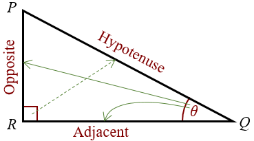
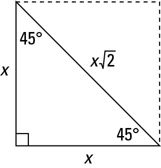

# Right Triangle Trigonometry

## Fundamental Terminology

A right triangle is a triangle that has one right angle.

A side **opposite** an angle is the side an angle opens into. A side **adjacent** to an angle is the adjacent side that is not the hypotenuse.


The opposite is also true for _both_ of the above...

An angle **opposite** a side is the angle _opened into from the angle_. An angle **adjacent** to a side that is not the hypotenuse is the adjacent angle _that is not the right angle_.


The **hypotenuse** is the longest side [in a _**right**_ triangle](#user-content-fn-1)[^1].

<figure><figcaption>
<strong>Image 1</strong> — A standard right triangle.
</figcaption></figure>

## The Right Triangle Altitude Theorem

There are three paths/versions of this theorem, all of which are essential to understanding right triangles. All three are derived after dropping an altitude down to the hypotenuse form the right angle. All three paths reference Image 2.

<figure><figcaption>
<strong>Image 2</strong> — A right triangle with an altitude dropped down to the hypotenuse.
</figcaption></figure>

<i class="fa-note">:note:</i> Path of Similarity

If an altitude is drawn to the hypotenuse of a right triangle, then the two resulting triangles are each similar to each other and the original triangle.

\triangle{ABC}\sim{}\triangle{ACD}\sim{}\triangle{CBD}

<i class="fa-note">:note:</i> Path of Altitude as a Geometric Mean

If an altitude is drawn to the hypotenuse of a right triangle, then its length is the geometric mean of the sections of the hypotenuse.

\frac{CD}{AD}=\frac{BD}{CD}

<i class="fa-note">:note:</i> Path of Legs as Geometric Means

If an altitude is drawn to the hypotenuse of a right triangle, then its legs are the geometric mean of the hypotenuse and the section of the hypotenuse that is adjacent to the leg.

\frac{AC}{AB}=\frac{AD}{AC}, \frac{BC}{AB}=\frac{BD}{BC}

## Pythagorean Theorem

A triangle is right if and only if the length of its hypotenuse, $$c$$, squared is equivalent to the sum of the lengths of each leg, $$a$$ and $$b$$, squared ($$a^2+b^2=c^2$$).

<i class="fa-thought-bubble">:thought-bubble:</i> Rationale

Referencing Image 2 and assuming that $$AB=c$$, $$BC=a$$, and $$AC=b$$...

\frac{y}{b}=\frac{b}{c} \rightarrow{} b^2=yc

\frac{x}{a}=\frac{a}{c} \rightarrow{} a^2=xc

Using addition postulate, we find that $$a^2+b^2=xc+yc$$. Using distributive property, we find that $$a^2+b^2=c(x+y)$$. Since $$c=x+y$$, we can substitute to result to the pythagorean theorem: $$a^2+b^2=c*c=c^2$$.

### Obtuse and Acute Corollaries

A triangle is obtuse if and only if $$c^2>a^2+b^2$$.

A triangle is acute if and only if $$c^2<a^2+b^2$$.

### Pythagorean Triples

A **pythagorean triple** is a pair of three integers that can create a non-degenerate right triangle when used as side lengths. Common ones include $$3,4,5$$ and $$5,12,13$$. [Multiples of pythagorean triples are also pythagorean triples](#user-content-fn-2)[^2].

## Special Right Triangles

The ratio of the legs to the hypotenuse in a **45-45-90 right triangle** is $$1:1:\sqrt{2}$$. This special triangle is half of a square.

The ratio of the legs to the hypotenuse in a **30-60-90 right triangle** is $$1:\sqrt{3}:2$$. This special triangle is half of an equilateral triangle.




<figure><figcaption>
<strong>Image 3</strong> — A 45-45-90 right triangle.
</figcaption></figure>





<figure><figcaption>
<strong>Image 4</strong> — A 30-60-90 right triangle.
</figcaption></figure>





All pairs of similar right triangles have a fixed side length ratio. Some of them are messy, which is why trigonometric ratios are used.


## Trigonometric Functions

### Basic Trigonometric Functions

The three basic trigonometric functions are sine, cosine, and tangent, and they each correspond to a specific ratio in point of view of one of the angles that is not the right angle...

$$
\sin{\theta{}}=\frac{\text{opp}}{\text{hyp}} \hspace{1cm} \cos{\theta{}}=\frac{\text{adj}}{\text{hyp}} \hspace{1cm} \tan{\theta{}}=\frac{\text{opp}}{\text{adj}}
$$

Using these functions is helpful for finding missing sides in right triangles. To find angles, we can rearrange the equations...

### Inverse Trigonometric Functions

The three inverse trigonometric functions are arcsine, arccosine, and arctangent, and they each correspond to a specific ratio in point of view of one of the angles that is not the right angle...

$$
\sin^{-1}(\frac{\text{opp}}{\text{hyp}})=\theta{} \hspace{1cm} \cos^{-1}(\frac{\text{adj}}{\text{hyp}})=\theta{} \hspace{1cm} \tan^{-1}(\frac{\text{opp}}{\text{adj}})=\theta{}
$$

Using these functions is helpful for finding missing angles in right triangles.

### Sine and Cosine of Complementary Angles

If we have an angle $$\theta{}$$ in a right triangle, the other non-right angle would have to be $$90-\theta{}$$. This is because the two angles that aren't the right angle must add up to 90°. The relationships are shown below...

$$
\sin{\theta{}}=\cos{(90\degree{}-\theta{})} \hspace{1cm} \cos{\theta{}}=\sin{(90\degree{}-\theta{})}
$$

In short, the sine of an angle is equal to the cosine of its complement, and vice versa.


## Example

If we are told that $$\cos{58\degree{}}=0.14$$, then $$\sin{32\degree{}}$$ would also be $$0.14$$. If we know the cosine of something, then the sin of its complement would be equivalent.


...

[^1]: The longest side in a _non-right_ triangle is _**not**_ a hypotenuse.

[^2]: $$6,8,10$$ and $$10,24,26$$ are also pythagorean triples.
