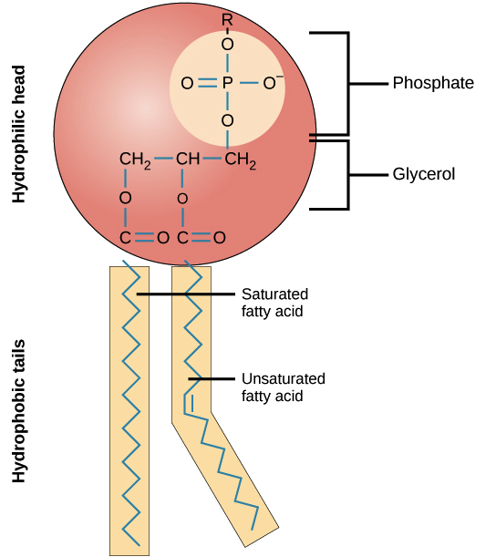

# Cells

## Systems

A **system** is a grouping of components that collaborate as part of a mechanism to perform a specific function or process. Systems...

* ...specific components with different functions.
* ...have compartmentalization and boundaries to encase their components.
* ...have inputs and outputs.
* ...process information.

## Cell Theory

**Cell theory** is of the following three rules...

1. _**All**_ living things are made up of cells.
2. Cells are the _**most basic**_ unit of structure and function in living things.
3. [All cells come from other cells](#user-content-fn-1)[^1] via reproduction[^2].

## Cell Size

Organisms can be unicellular or multicellular. Multicellular organisms are made up of many cells, making it hard to not to question why cells are so small; it's hard to question why human beings aren't just one large cell.

**Diffusion** is [the movement of molecules from a high to low concentration of such](#user-content-fn-3)[^3]. All cells have a **cell membrane**, which acts as a boundary to the [organelles](cells.md#organelles) in cells. This membrane allows materials in that cell use to do specific functions.

### Cellular Efficiency

All cells require a certain amount of material to sustain itself. The following are surface area to volume ratios of some cubic shapes...

<table><thead><tr><th align="right">Block Size</th><th width="140.20703125" align="center">Volume</th><th width="139.546875" align="center">Surface Area</th><th>SA:V Ratio</th></tr></thead><tbody><tr><td align="right">1x1x1 cm</td><td align="center">1 cm3</td><td align="center">6 cm2</td><td>6:1</td></tr><tr><td align="right">2x2x2 cm</td><td align="center">8 cm3</td><td align="center">24 cm2</td><td>3:1</td></tr><tr><td align="right">3x3x3 cm</td><td align="center">27 cm3</td><td align="center">54 cm2</td><td>2:1</td></tr></tbody></table>

As the volume of cells increase, the surface area also increases, [yet at a smaller exponentiation](#user-content-fn-4)[^4]. Thus, the ratio of volume to surface area also decreases exponentially. When there is a lot of volume, the cell has more inside of it, thus needing more materials to sustain itself. When the amount of surface area is too low to diffuse enough materials through, the cell increases its risk of dying.

This ratio is called **cellular efficiency**; this is why cells are small, as the smaller the cell, the larger the efficiency.

## Levels of Organization

The levels are as follows...

<table><thead><tr><th width="299.73828125" align="right">Level</th><th>Description</th></tr></thead><tbody><tr><td align="right"><a data-footnote-ref href="#user-content-fn-5">Cell</a></td><td>A singular cell.</td></tr><tr><td align="right">Tissue</td><td>Multiple cells working together for one function.</td></tr><tr><td align="right">Organ</td><td>Multiple tissues working together for one function.</td></tr><tr><td align="right">Organ System</td><td>Multiple organs working together for one function.</td></tr><tr><td align="right">Organism</td><td>All organ systems working together <strong>to maintain homeostasis</strong>.</td></tr></tbody></table>

### The Four Types of Tissue

There are four types of tissues, all for different purposes...

<table><thead><tr><th width="360.14453125" align="right">Type of Tissue</th><th>Function</th></tr></thead><tbody><tr><td align="right">Epithelial Tissue</td><td>For protection.</td></tr><tr><td align="right">Connective Tissue</td><td>For support and protection.</td></tr><tr><td align="right">Muscle Tissue</td><td>For movement.</td></tr><tr><td align="right">Nervous Tissue</td><td>For communication.</td></tr></tbody></table>

## Organelles

An [**organelle**](#user-content-fn-6)[^6] is a specialized structure inside of a cell with a specific function. There are different organelles in prokaryotic and eukaryotic cells and different organelles in plant and animal cells.

### Prokaryotic vs. Eukaryotic Cells

Prokaryotic cells (consisting of bacteria and archaea) are comparatively smaller and have genetic material that is not contained in a nucleus. Eukaryotic cells (consisting of eukaryota) are larger and have nucleus-bound genetic material. Eukaryotic cells have a nucleus, while prokaryotic cells don't.

### Plant vs. Animal Cells

Plant cells are comparatively larger with a rectangular or cubic shape. Animal cells are smaller and have a round or irregular shape. Plant cells exclusively have cell walls and chloroplasts. Animal cells exclusively have lysosomes.

Here is a list of all the organelles found in cells...

<table><thead><tr><th width="109.9375" align="center">Multiple</th><th width="175.19140625" align="center">Organelle</th><th width="355.0703125">Description</th><th align="center">Found in</th></tr></thead><tbody><tr><td align="center">True</td><td align="center">Mitochondrion</td><td>The site of <a data-footnote-ref href="#user-content-fn-7">cellular respiration</a>.</td><td align="center">Both</td></tr><tr><td align="center">True</td><td align="center">Chloroplast</td><td>The site of <a data-footnote-ref href="#user-content-fn-8">photosynthesis</a>.</td><td align="center">Plants</td></tr><tr><td align="center">False</td><td align="center">Nucleus</td><td>Contains and protects genetic information, coordinates <a data-footnote-ref href="#user-content-fn-9">cell’s activities</a>, and contains the <a data-footnote-ref href="#user-content-fn-10">nucleolus</a>.</td><td align="center">Both</td></tr><tr><td align="center">True</td><td align="center">Ribosome</td><td>Carries out protein synthesis. They can be found on the Rough Endoplasmic Reticulum or in the <a data-footnote-ref href="#user-content-fn-11">cytoplasm</a>.</td><td align="center">Both</td></tr><tr><td align="center">True</td><td align="center">Lysosome</td><td>Digests nutrients and recycles waste products.</td><td align="center">Animals</td></tr><tr><td align="center">True</td><td align="center">Vacuole</td><td>Storage area for water, nutrients, and waste. Animal cells have many smaller vacuoles with different functions. Plant cells have a large, central vacuole with a generalized purpose.</td><td align="center">Both</td></tr><tr><td align="center">False</td><td align="center">Rough Endoplasmic Reticulum</td><td>The <em>rough</em> endoplasmic reticulum is a system of membrane-enclosed sacs and tubules in the cell. They carry out protein synthesis and send these folded <em><strong>proteins</strong></em> to golgi bodies for transport.</td><td align="center">Both</td></tr><tr><td align="center">False</td><td align="center">Smooth Endoplasmic Reticulum</td><td>The <em>smooth</em> endoplasmic reticulum is a system of membrane-enclosed sacs and tubules in the cell. They send <em><strong>lipids</strong></em> to golgi bodies for transport.</td><td align="center">Both</td></tr><tr><td align="center">False</td><td align="center">Golgi Body</td><td>Receives <a data-footnote-ref href="#user-content-fn-12">products of the endoplasmic reticulum</a> which are modified and stored. These materials are then sent to other destinations.</td><td align="center">Both</td></tr></tbody></table>

## Cell Membrane Structure

Cells have a **semi-permeable membrane**, meaning the membrane is _selective_ in what it allows to pass through. This is to allow efficient movement of things like water, nutrients, carbon dioxide, oxygen, and waste.

Cell membranes are made of a **phospholipid bilayer**. Because phospholipids have a hydrophilic head and hydrophobic tails, the heads face [the exteriors of the membrane](#user-content-fn-13)[^13].




<figure><figcaption>
<strong>Image 1</strong> — Phospholipid diagram.
</figcaption></figure>





<figure><figcaption>
<strong>Image 2</strong> — Phospholipid bilayer diagram.
</figcaption></figure>




This creates a bilayer like what is shown in Image 2.

Proteins also inhabit the cell membrane, being _embedded_ within the phospholipid bilayer.

<figure><figcaption>
<strong>Image 3</strong> — Example of the fluid-mosaic model.
</figcaption></figure>

Image 3 shows the current accepted model for cell membranes, called [the fluid-mosaic model](#user-content-fn-14)[^14].

### Evidence For The Structure of Cell Membranes

Membranes have a chemical composition containing both proteins and lipids, proving the "mosaic" part of fluid-mosaic.

When a membrane is split open and revealed, proteins can be seen in the layer showing that proteins aren't arranged in a layer surrounding the phospholipid bilayer.

Two researchers at John Hopkins University—Frye and Ediden—labelled the proteins of two different cells. They then fused the two cells and recorded to find the labelled proteins all mixed together. This proves the "fluid" part of fluid-mosaic, as proteins aren't stationary and can move around in the membrane.

## Cell Membrane Transport

Cells need materials to move in and out of the cell. Cell membranes mediate this, by allowing some materials in and not allowing others. Some materials can easily pass through the membrane, but others need help.

### Passive Transport

**Passive transport** is a type of molecule movement into and out of the cell, where molecules _do not_ require energy and can easily pass through the cell. This happens when a molecule is going _with_ the **concentration gradient** (high to low concentration).


## Note

Passive transport _**is the same as**_ diffusion. They are interchangeable terms.


#### Simple Diffusion

In **simple diffusion**, molecules like oxygen (O2) and carbon dioxide (CO2) are small enough to simply pass through the membrane. Water can also pass through, yet at a slow speed.

#### Facilitated Diffusion

This is also a type of diffusion, but it uses enzymes to help materials pass through the membrane. There are two types of facilitated diffusion.

<i class="fa-memo-pad">:memo-pad:</i> Facilitated Diffusion by a Channel

**Facilitated diffusion by a channel** is when the molecule "walks along" a corridor like enzyme. This is generally for specific molecules or ionic molecules. For example, water tends to pass through the membrane via an enzyme called the aquaporin.

<i class="fa-memo-pad">:memo-pad:</i> Facilitated Diffusion by a Carrier

**Facilitated diffusion by a carrier** is when the enzyme changes its shape to allow the molecule to pass through. This is generally for larger molecules. For example, glucose tends to pass through the membrane via an enzyme called the GLUT Transporter.

### Active Transport

**Active transport** is a type of molecule movement into and out of the cell, where molecules _do_ require energy as they can't pass through the cell on their own. This happens when a molecule is going _against_ the concentration gradient (low to high concentration).


## Example

Though it might seem useless going against the concentration gradient is useful...

In an environment, there may be _less_ glucose compared to inside a cell. The cell still needs the glucose, but can't use passive transport. Energy (specifically ATP) is used to _boost_ molecules to going against the concentration gradient.


### Sodium-Potassium Pump

The **Sodium-Potassium Pump** is an enzyme that, upon activation, releases _three_ sodium ions and allows in _two_ potassium ions. This is generally done to balance the extracellular[^15] and intracellular[^16] environments.

### Endocytosis and Exocytosis

In **endocytosis**, a group of similar molecules attempting to enter a cell will have a vesicle[^17] form around them. When leaving, this same vesicle will merge with the membrane and release the molecules in **exocytosis**.

<figure><figcaption>
<strong>Image 4</strong> — Comparison between exocytosis and endocytosis.
</figcaption></figure>


## Note

Vesicles and vacuoles are made up of phospholipid bilayers too.

Enzymes—along with the nature and properties of phospholipids—help to connect the membranes of vesicles and vacuoles to that of the actual cell membrane.


## Osmosis

**Osmosis** if the exclusive diffusion of _water_ from high to low concentrations of it across a semi-permeable membrane.

### The Dissolving of Substances

A **solvent** is a medium that _does_ the dissolving. A **solute** is a substance that _is_ being dissolved. Mixing a solvent with one or more solutes results in a **solution**.

The **concentration** of a solution is calculated as the ratio between the amount of the solute to the amount of the solvent (solute:solvent). A solution is **dilute** if it has [a low concentration of the solute](#user-content-fn-18)[^18].

### Extracellular Solutions

Two regions reach **dynamic equilibrium** when the concentration in both regions are _equal_.

An extracellular solution is **hypertonic** if it results in a net movement _outside_ of the cell.

An extracellular solution is **hypotonic** if it results in a net movement _inside_ the cell.

An extracellular solution is **isotonic** if it results in _no_ net movement.

#### Situations Within Animal Cells

In a _hypertonic_ solution, water in the cells will leave more than they enter, resulting in a net movement _outside_ of the cell. Animal cells in this situation will crenate[^19].

In a _hypotonic_ solution, water in the cells will enter more than they leave, resulting in a net movement _inside_ the cell. Animal cells in this situation will lyse[^20].

In a _isotonic_ solution, water in the cells will enter at the same rate that they leave, resulting in _no_ net movement. Animal cells in this situation will look normal.

#### Situations Within Plant Cells

In a _hypertonic_ solution, water in the cells will leave more than they enter, resulting in a net movement _outside_ of the cell. Plant cells in this situation will plasmolyse[^21].

In a _hypotonic_ solution, water in the cells will enter more than they leave, resulting in a net movement _inside_ the cell. Plant cells in this situation become turgid[^22].


## Fun Fact

Celery becomes crisp when water is applied because plant cells become turgid when in a hypotonic solution.


In a _isotonic_ solution, water in the cells will enter at the same rate that they leave, resulting in _no_ net movement. Plant cells in this situation will look normal.


## Note

Cells—both plant and animal—eventually _die_ after being exposed to hypotonic or hypertonic solutions for too long.


[^1]: New cells are produced from old ones.

[^2]: Specifically mitosis.

[^3]: When a specific type molecule is more concentrated in a zone, A, and less concentrated in a zone, B, they tend to move from Zone A to Zone B.

    &#x20;$$\text{}$$

    This movement is called diffusion!

[^4]: Volume is exponentiated to the power of 3, yet surfaced area is to the power of 2. Though both increase exponentially, surface area increases at a slower rate.

[^5]: Generally a specialized cell. Multiple of the same specilization tend to work together to perform functions.

[^6]: Means "_little organ_."

[^7]: The process that uses oxygen to release energy from sugars.

    &#x20;$$\text{}$$

    [More on this...](ecology.md#fluxes)

[^8]: The process that uses sunlight to convert water and carbon dioxide into glucose (C6H12O6).

    &#x20;$$\text{}$$

    [More on this...](ecology.md#fluxes)

[^9]: e.g. cell division, replication, etc.

[^10]: The place where ribosomes are made.

[^11]: Ribosomes in the cytoplasm are not bound (free).

[^12]: Whether it be proteins from the RER or lipids from the SER.

[^13]: Outside (extracellular) and inside (intracellular) the cell.

[^14]: **"**_**Fluid**_**":** Components can move sideways across the membrane (like in a sea).

    ㅤ

    **"**_**Mosaic**_**":** Membrane is composed of diverse parts (different proteins).

[^15]: Outside of the cell.

[^16]: Inside the cell.

[^17]: A kind of compartment, akin to that of vacuoles (vacuoles being larger).

[^18]: There is more of the solvent than of the solute.

[^19]: Crenated cells tend to look shrivelled up with jagged edges.

[^20]: When a cell lyses, it bursts.

[^21]: The plant cell's cytoplasm and cell membrane shrink and pull away from the rigid cell wall.

[^22]: When there is a lot of water in the cell, the cell's vacuole swells, exerting pressure against the cell wall.
