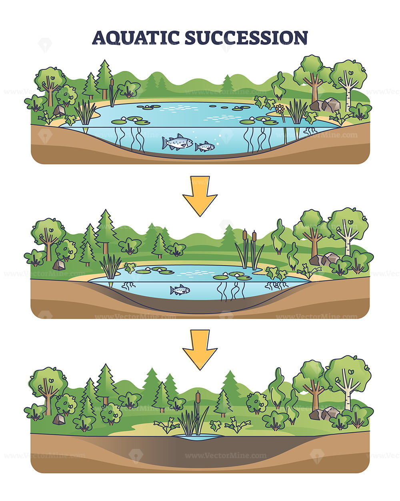

# Ecology

## Abiotic and Biotic Factors

Abiotic factors are [nonliving physical and chemical components of an environment](#user-content-fn-1)[^1]. They may affect life, but aren’t _actually_ living.

On the other hand, biotic factors are living—or once-living—components of an environment. Examples would include plants, animals, and [their remains](#user-content-fn-2)[^2].

## Trophic Levels

Ecology is the study of the environment and how the organisms interact with each other in that environment. The following are the different trophic levels of organisms in an ecosystem:

* **Producers** or autotrophs (plants, green algae) via photosynthesis or chemosynthesis.
* **Consumers** or heterotrophs that cannot produce their own food, so they rely on other organisms for energy and nutrients.
* **Decomposers** break down remains of plants and animals (organic matter), [releasing substances that can be reused and recycled](#user-content-fn-3)[^3] in the ecosystem. This mainly consists of fungi and bacteria.

Producers make their own food from sunlight via photosynthesis, thus having no prey. Primary consumers (or herbivores) eat the producers, secondary consumers eat the primary consumers, and so on until you get to the apex predators; the apex predator has no predators.

Without decomposers, energy would remain locked after an organism dies. Because of this, [all organisms are technically eaten by decomposers](#user-content-fn-4)[^4].

## Representations of Trophic Level Relationships

### Food Chains

Food chains are a visual representation of relationships between trophic levels. Each trophic level has a representative organism which helps a chain continue. At the bottom is generally the producer and at the top is the apex predator.

Decomposers are not usually included in food chains.

### Food Webs

Food webs are another visual representation that shows _**all**_ relationships between organisms of different trophic levels in an ecosystem. Arrows[^5] pointing from another show predator-prey relationships.

A food web is all the food chains of an ecosystem. Because food webs aren’t limited to being in a straight line[^6], they are much more flexible to allow [more complicated relationships](#user-content-fn-7)[^7] to happen. However, though this is true, an organism at a higher trophic level _does not necessarily_ eat all organisms in trophic levels below it.

## Biomass and Energy

### Biomass

Biomass is a measure of the total mass of living material in each trophic level, otherwise known as organic matter.

A pyramid of biomass is a representation of the total mass of all organisms at each trophic level in an ecosystem. In the visual pyramid itself, width corresponds to amount of matter, increasing in size at the bottom as more organisms of lower trophic levels are required to sustain less of higher trophic levels.

### Energy

Energy is [the ability to do work](#user-content-fn-8)[^8] and is measured in calories.

Only about 10% of energy (on average) at one trophic level is transferred to the next in an ecosystem. The other 90% of the energy available at one trophic level is not transferred to the next. The remaining energy is instead lost as _heat_ and used by the organism itself for life processes (movement, growth, metabolism, etc.). In the visual pyramid, width corresponds to the amount of calories (or energy) transferred from consuming the previous, lower trophic level.

### The Difference

The difference is that biomass scales with the amount of the organism needed to sustain one organism of the next trophic level. If 6 corn is (theoretically) needed to feed one chicken and 85 chicken is (theoretically) needed to feed one human, the biomass pyramid would have the following...

<table data-header-hidden><thead><tr><th width="345.23046875" align="right"></th><th></th></tr></thead><tbody><tr><td align="right">1 Human</td><td>Total mass of the human</td></tr><tr><td align="right">85 Chickens</td><td>Total mass of all the chickens</td></tr><tr><td align="right">510 Corn</td><td>Total mass of all the corn</td></tr></tbody></table>

On the other hand, energy is lost transferring from one trophic level to the next. If 1 corn (theoretically) contains 100 calories. A chicken that eats the corn would get 10 calories. A human that then eats the chicken would get only 1 calorie from that single corn alone. However, if a human eats the same corn gets the same 10 calories the chicken got.

## Organismal Relationships

There are five different relationships organisms may have with other organisms:

### General Relationships

**Predator-Prey** relationships are very common, being the relationship between, yes, predators and prey. This relationship exists between organisms because of the predator’s need for a food source.

**Competition** is when two different organisms compete for the _same_ resources in the _same_ place. There are two branching relationships from this. _Intraspecific_ competition is when two organisms of the **same** species compete for the same resources. On the other hand, _interspecific_ competition is when two organisms of _**different**_ species compete for the same resources.


## Common Misconception

**Interspecific** competition is between _**two different**_ species!

**Intraspecific** competition is between _**two of the same**_ species!


To note, an [adaptation](evolution.md#selection) is any heritable trait that helps an organism survive and reproduce in its environment. If an organism has a trait that gives it an advantage over another organism in either of the two above relationships, then the former organism will thrive whilst the other nears extinction.

### Symbiotic Relationships

Symbiosis is a close ecological relationship of organisms within an ecosystem. These two species live in close, long-term contact and tend to interact with each other in one of three ways.

**Mutualism** is when _both_ organisms benefit from their interaction in the relationship. For example, between clownfish and anemones, the clownfish gains protection from predators by living among the anemone's stinging tentacles and the anemone benefits from the clownfish's cleaning, defense, and nutrient provision.

**Commensalism** is when one organism benefits in the relationship and the other organism is _unaffected_ (more or less). For example, barnacles get a mobile home and access to food-rich currents as the whale swims, while the whale experiences no significant harm.

**Parasitism** is when one organism benefits in the relationship and the other organism is _harmed_. For example, harmful viruses use larger animals as a host to reproduce. This comes at the expense of the host, who gets very mildly to extremely sick, depending on the virus.

## Patterns of Population Growth

Increasing growth rate is possible when resource availability high, while competition and predation are low. There are two types of population growth: exponential and logistic growth. In **exponential growth**, the population will continue to grow[^9] forever. In **logistic growth**, the population will grow, eventually plateauing at a point in time.

Carrying capacity is the amount of a population that an environment can approximately hold. A population will tend to overshoot the carrying capacity at first, before fluctuating above and below the carrying capacity.

<figure><figcaption>
<strong>Image 1</strong> — Phases of logistic growth.
</figcaption></figure>

### Limiting Factors

Limiting factors are what determine where the carrying capacity is. The amount of resources limits the number of organisms an ecosystem can support. The carrying capacity is equal to the total number of available resources divided by the number of resources required per individual. Because of how flexible limiting factors are, carrying capacities can change over time.

### Competitions Affect on Population Growth

Competition can affect population growth because of natural selection. If one organism has traits better suited for finding resources than another, the former will increase in population while the latter will decrease.

### Habitats and Niches

Organisms live in a habitat—which is the general area where an organism lives—and many species of the same ecosystem can coexist in the same habitat. However, each organism has a particular role in an ecosystem—this is their niche—which includes its habitat, food, and use of resources. No two species can occupy the same exact niche at the same time.

The Competitive Exclusion Principle states two things...

> 1. If two species have overlapping niches, competition occurs for limited resources.
> 2. Two species can't coexist if they occupy almost the same niche in a habitat. One will eventually outcompete the other, in which the latter would go locally extinct.

This is why almost _**all**_ ecosystems have no two species with almost identical niches.

## Ecological Succession

The levels of the organization of life include...

<table data-header-hidden><thead><tr><th width="279.515625" align="right"></th><th></th></tr></thead><tbody><tr><td align="right">Organism</td><td>An individual.</td></tr><tr><td align="right">Population</td><td>A group of individuals that belong to the same species.</td></tr><tr><td align="right">Community</td><td>Multiple populations in a defined area.</td></tr><tr><td align="right">Ecosystem</td><td>All organisms that live in a place together with physical environment.</td></tr><tr><td align="right">Biome</td><td>A group of ecosystems that share similar characteristics.</td></tr><tr><td align="right">Biosphere</td><td>All life on the entire planet.</td></tr></tbody></table>

Ecological succession is the sequence of community and ecosystem changes following a _disturbance_. Disturbances greatly affect an ecosystem, and can range from forest fires to volcanic eruptions.

**Primary succession** is an ecological succession on [a surface that is lifeless, with _**no**_ soil](#user-content-fn-10)[^10]. Over centuries, soil will form via weathering and decomposition of early colonizers.

**Secondary succession** is an ecological succession in [an existing community that has been partially destroyed without removing soil](#user-content-fn-11)[^11].

At the start of both successions, small fast-growing plants like grass or weeds—called [pioneer species](#user-content-fn-12)[^12]—will begin to thrive. These species modify the environment and allow other plant species to grow. All plants living in the environment will then attract animals into the ecosystem. This is when an ecosystem reaches its climax community, which is when an ecosystem is mature and stable; this is the final stage of ecological succession.


## Note

In secondary succession, soil is already present, meaning it takes less time to reach climax community than in primary succession.


<i class="fa-bookmark-plus">:bookmark-plus:</i> <strong>Additional Concept</strong> — Aquatic Succession

**Aquatic succession** is the process of changing an _aquatic_ ecosystem into terrestrial ecosystem.

This happens when streams and rivers that feed into lakes dump in sediment, causing soil to erode from hillsides and deposit into the lakes. This slows the building up of the bottom soil layer until there is _no water_ left.

<figure><figcaption>
<strong>Image 2</strong> — Aquatic succession.
</figcaption></figure>

Aquatic succession turns lakes into wetlands, and from there into dry land. This process can take [hundreds or thousands of years](#user-content-fn-13)[^13]. When aquatic succession happens, aquatic species _retreat_ and terrestrial plant species _colonize_.

## Global Reservoirs

There four global reservoirs[^14] are...

<table data-header-hidden><thead><tr><th width="305.46875" align="right"></th><th></th></tr></thead><tbody><tr><td align="right">Geosphere</td><td>All ground, soil, and other akin materials.</td></tr><tr><td align="right">Atmosphere</td><td>All air and substances around it.</td></tr><tr><td align="right">Hydrosphere</td><td>All water bodies.</td></tr><tr><td align="right">Biosphere</td><td>All life on the entire planet.</td></tr></tbody></table>

## Biomes

Biomes are groups of ecosystems that share similar characteristics. Biomes are defined by its climate. Climates are composed of two major factors: temperature and precipitation.


## Warning

There is a difference between climate and weather. Weather is _short_-term temperature and precipitation, but climate is weather over a _long_ period of time.


### Climate Zones

Climate zones result from the amount of solar energy that reaches the earth’s surface. Climate can be influenced by latitude (distance from the equator), elevation (altitude above sea level), and humidity (moisture)

The climate zones are...

<table data-header-hidden><thead><tr><th width="314.60546875" align="right"></th><th></th></tr></thead><tbody><tr><td align="right">Tropical</td><td>Closest to equator</td></tr><tr><td align="right">Subtropical</td><td>Temperate</td></tr><tr><td align="right">Subarctic</td><td>Boreal</td></tr><tr><td align="right">Arctic</td><td>Farthest from equator</td></tr></tbody></table>

## Nitrogen Cycle

Plants need nitrogen to grow, and 78% of our atmosphere is nitrogen gas. We call this atmospheric nitrogen (N2). Plants need nitrogen to build proteins. A lot of nitrogen is in the air as atmospheric nitrogen, but plants can't use it. Plants get nitrogen from nitrates (NO3–).

One way we can turn atmospheric nitrogen into nitrates is through lighting strikes. Lightning uses its immense energy to _break_ apart atmospheric nitrogen molecules. These separated nitrogen atoms then combine with oxygen in the air to form nitrates.

### [Soil to Organism](#user-content-fn-15)[^15]

Nitrifying bacteria convert ammonia into nitrites (NO2–), which is then turned into nitrates (NO3–) to be used by plants. Plants take in nitrates in the soil and animals, in turn, eat plants containing nitrates.

### Air to Soil

Nitrogen-fixing bacteria convert nitrites into ammonia. Nitrogen-fixing bacteria are found in the soil, the roots of legumes[^16], and in oceans[^17].

### Organism to Soil

[Ammonifying bacteria](#user-content-fn-18)[^18] break down proteins in dead organisms and animal wastes into ammonium.

### Soil to Air

Denitrifying bacteria take nitrates into atmospheric nitrogen, returning to the air.

## Carbon Cycle

### Organic vs. Inorganic Matter

Organic matter contains the two essential elements of life: carbon and hydrogen, while inorganic matter doesn’t. If something doesn't contain _both_ carbon _**and**_ hydrogen, it is inorganic.

### Fluxes

Fluxes are movements of carbon between different reservoirs.

**Photosynthesis** is the process plants use to make their own energy. Plants take in carbon dioxide, light energy, and water. They then convert them into oxygen and ATP[^19].

**Cellular respiration** takes in glucose and oxygen and releases carbon dioxide and water. Producers, consumers, and decomposers perform respiration.


## Extra Note

Plants actually do cellular respiration, but choose to do _mainly_ photosynthesis instead.


**Combustion** is the burning of something to release carbon and thermal energy.

### Carbon Cycle in 1700 vs. 2000

Majority of the carbon in the carbon cycle ends up in the atmosphere and biosphere. As a result, there is less carbon in soil and fossil fuel reservoirs. This is due to the industrial revolution and the constant extraction of fossil fuels from the earth.

[^1]: Examples would include climate, water, soil quality, temperature, pH level, air, and nutrient availability.

[^2]: Some soils contain decomposed plant matter. This _still_ counts as a biotic factor, making the soil _partially_ biotic and _partially_ abiotic.

[^3]: Without them, carbon, nitrogen, and other elements would remain tied up in organic matter.

[^4]: Albeit, only after death.

[^5]: Pointing from the prey to the predator to signal consumption.

[^6]: or chain

[^7]: A tertiary consumer may eat a primary consumer (higher trophic level eating multiple organisms of a lower trophic level of organisms from multiple lower trophic levels).

[^8]: Chemical potential energy, thermal energy, kinetic energy, etc.

[^9]: At an increasing rate (exponentially).

[^10]: Bare rocks left after a lava flow or glacial retreat.

[^11]: After a forest fire.

[^12]: Lichen are a good example of this, as they _don’t_ need soil to grow.

[^13]: This can be sped up via droughts and mass erosion events.

[^14]: These are also more commonly referred to as the spheres of Earth.

[^15]: Also known as assimilation.

[^16]: Plants of and akin to beans.

[^17]: Plants like blue-green algae.

[^18]: These bacteria are decomposers.

[^19]: Obtained in the form of glucose.
