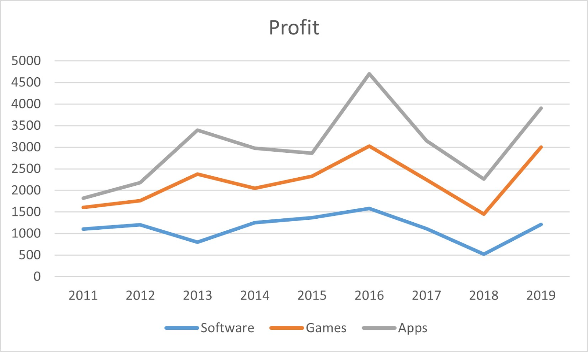

# Foundations of Life

## The Characteristics of Life

Biology is the _scientific_ study of life. In order to discern what we _actually_ study in biology, we must first define _life_.

The following are the seven characteristics of life. If something exhibits _**all**_ of the following, it is a living thing; if it doesn't exhibit _at least one_, it is **not** living.

### Environmental Response

The thing in question must do actions in response to its environment. For example, some frogs can let its heart stop beating and can shut down its body functions in order to survive frigid temperatures of its environment.

### Metabolism

The thing in question must do chemical reactions in order to produce energy. Without energy, an organism would die.

### Evolution/Adaptation

The thing in question must be able to [adapt](evolution.md#selection) through gaining altered characteristics and favoring them to thrive in its environment.

### Growth/Development

The thing in question must go through changes[^1] in its time alive, from birth to death.

### Lifespan/Mortality

The thing in question must be able to die eventually.

### Organization

The thing in question must be made up of [cells](cells.md), which are to provide it structure, organization, and function.

### Reproduction

The thing in question must be able to [mate with those of the same species in order to produce offspring](evolution.md#speciation).

### Homeostasis

The thing in question must require a _stable_ internal environment. Without homeostasis, an organism would die.

## Life Processes

The following are processes that all living things partake in.

### Nutrition

Nutrition is the obtainment of materials (nutrients) for energy.

### Transportation

Transportation is the movement of materials into, out of, and around an organism.

### Organismal Respiration

Organismal respiration is the exchange of oxygen and carbon dioxide in organisms.

### Excretion

Excretion is the list of all metabolic reactions that produce waste chemicals _and_ heat. Having too much waste or heat in an organism can ruin homeostasis and possibly _kill_ an organism.

### Synthesis

Synthesis is the building of more complicated molecules using comparatively less complicated molecules.

### Regulation

Regulations are changes to cellular and organismal behavior an organism will make in order to maintain [homeostasis](foundations-of-life.md#homeostasis). For example, people shiver to get extra heat when in cold environments.

## Scientific Method

A hypothesis is a [testable statement](#user-content-fn-2)[^2] made using prior knowledge and observations. It generally proposes a relationship or explanation.

The scientific method is the series of steps that scientists use to verify or disprove hypotheses.

### The Steps



#### Observe

Make an observation of a specific thing or environment.



#### Question

Think about the reason on why this observed thing happens or the relationship between things in an observed environment; question why something occurs.



#### Hypothesize

Formulate a hypothesis that can be tested, in which answering it will clarify your questions.



#### Experiment

Test your hypothesis using a controlled experiment or observational study.



#### Analyze

Analyze the data from your experiment's results.



#### Conclude

Make a conclusion based on your data; this conclusion should _either_ validate or disprove your hypothesis.



#### Repeat

Repeat steps 4-6 to further strengthen the validity of your hypothesis and clarify any further questions. Repeat the _**entire**_ scientific method to validate correlating hypotheses.



In order to actually test hypotheses, scientists must do experiments. There are two different data collection methods: one is direct observation and monitoring of events in a region in the real-world environment. The other, however, is the more useful of the two: controlled experiments.

### Parts of an Experiment

In a controlled experiment, scientists have _full_ control over the environment, and are able to manipulate it to their will. This ease makes it simple to simulate what might happen in the real-world environment without directly changing the real-world environment.

#### Groups

In experiments in general, there are always multiple groups of a certain organism or object. Each group gets a different treatment in the experiment.

The experimental group is the group that is manipulated to directly test the hypothesis. The control group, on the other hand, is the group that doesn’t get any treatment; they aren’t modified throughout the experiment and are typically used in comparison to the experimental group to find altercations in response to changes in variables.

<i class="fa-thought-bubble">:thought-bubble:</i> <strong>Scenario 1</strong> — <em>Premasin 86</em> Experiment

A study at a prestigious university wanted to test whether a [new drug](#user-content-fn-3)[^3] affects a person’s cognitive ability. The scientists chose 40 participants who do not have any brain injuries or disabilities and split them into two groups of 20. Group A is given 25 milligrams of _Premasin 86_. Group B is, instead, given a placebo in the form of a harmless sugar pill.

After 24 hours, all participants are given a timed cognitive assessment to complete; data is collected. Group A performed at an average score of 28 out of 50. Group B performed much better at an average score of 42 out of 50.

Scientists then ran further iterations of the experiment and recorded data in the same way; they concluded that _Premasin 86_ does affect the consumer’s cognitive ability.

In Scenario 1, the experimental group is Group A, whilst the control group is Group B. This is because Group A is the group that receives _Premasin 86_; Group B doesn't receive anything and is monitored as a comparison to Group A.

#### Variables

There are three different types of variables a scientist will define in an experiment.

The independent variable is the variable that is being _deliberately_ manipulated to test the hypothesis. In Scenario 1, the independent variable is the dosage of _Premasin 86_, where Group A gets 25 milligrams and Group B gets [0 milligrams](#user-content-fn-4)[^4].

The dependent variable is the variable that changes in response to altercations of the independent variable; it is also the variable that is recorded as data. In Scenario 1, the dependent variable is the score participants get on the test.

Constants are variables that are _**not**_ altered throughout the experiment. They stay the same to ensure that the dependent variable doesn’t alter for any reason but the independent variable. In Scenario 1, one constant is absence of mental conditions in all participants. A second constant is obviously the drug being given: _Premasin 86_.


There may only be _**one**_ independent and dependent variable, but an _endless_ number of constants.


Scientists must describe the way a dependent variable must be measured. This is called the operational definition. Dependent variables can be quantitative or qualitative.

If a dependent variable is quantitative, it is a numerical value. If a dependent variable is qualitative, it is a physical description or characteristic. In Scenario 1, the dependent variable is quantitative, as the numerical score participants receive on the cognitive assessment is recorded.

#### Other Experimental Notes

Note that many trials and/or a large sample size reduces the significance of randomness. This makes it replicable by other scientists further testing the hypothesis.

Bias is the subjective influence of personal opinion or prejudice. It is important make an experiment _as unbiased as possible_ and to take _only_ data, not assumptions from experimental results.

## Graphing

### Parts of a Graph

Graphs are an important part of scientists’ data collection, as they represent data in different ways. In most graphs there is usually...

* ...a title that demonstrates the relationship between the independent and dependent variables.
* ...an x-axis label, which displays the independent variable and the unit it is recorded in.
* ...a y-axis label, which displays the dependent variable and the unit it is recorded in.
* ...a scale, where both axes are given scaled benchmarks based on the respective variable and unit of measurement it's recorded in.
* ...a key (or legend), where the meanings of symbols, colors, and other indicators on the graph are given for reference.

### Different Types of Graphs

Scatterplots are graphical representations that are used to determine correlation between variables. See Figure 1.

Line graphs are graphical representations that are used to show continuous data over a given amount of time. They can also contain multiple lines for comparisons against variables. See Figure 2.

Bar graphs are graphical representations that are used to show categorical data. They can also show comparisons between multiple categories. See Figure 3.




<figure><figcaption>
<strong>Image 1</strong> — Sample scatterplot.
</figcaption></figure>





<figure><figcaption>
<strong>Image 2</strong> — Sample line graph.
</figcaption></figure>





<figure><figcaption>
<strong>Image 3</strong> — Sample bar graph.
</figcaption></figure>




Using these graphs, you can visualize data—especially those of experiments—more easily.

## Lab Tools

<table data-column-title-hidden data-view="cards"><thead><tr><th align="center">Name</th><th>Function</th><th data-hidden data-card-cover data-type="image">Cover image</th></tr></thead><tbody><tr><td align="center"><strong>Glass Slide</strong></td><td>Used to hold a specimen or sample under a microscope.</td><td><a href="https://www.marienfeld-superior.com/files/Medien/Produkte/Mikroskopie_Zubehoer/Objekttraeger_Zubehoer/10.Microscope-slide_cut-edges_plain.jpg">https://www.marienfeld-superior.com/files/Medien/Produkte/Mikroskopie_Zubehoer/Objekttraeger_Zubehoer/10.Microscope-slide_cut-edges_plain.jpg</a></td></tr><tr><td align="center"><strong>Coverslip</strong></td><td>Placed over specimens on a slide to keep it in place and covered for observation.</td><td data-object-fit="fill"><a href="https://chemglass.com/images/thumbs/0004775_cover-slips-quartz-coverslips.jpeg">https://chemglass.com/images/thumbs/0004775_cover-slips-quartz-coverslips.jpeg</a></td></tr><tr><td align="center"><strong>Petri Dish</strong></td><td>Used to <a data-footnote-ref href="#user-content-fn-5">culture cells</a>.</td><td><a href="https://www.carolina.com/images/product/large/741270_w.jpg">https://www.carolina.com/images/product/large/741270_w.jpg</a></td></tr><tr><td align="center"><strong>Erlenmeyer Flask</strong></td><td>Used to mix, heat, and store liquids.</td><td data-object-fit="fill"><a href="https://www.microtechscientific.com/wp-content/uploads/2013/08/erlenmeyer-flasks.jpg">https://www.microtechscientific.com/wp-content/uploads/2013/08/erlenmeyer-flasks.jpg</a></td></tr><tr><td align="center"><strong>Beaker</strong></td><td>Used for mixing and heating chemicals.</td><td><a href="https://www.sigmaaldrich.com/deepweb/assets/sigmaaldrich/marketing/global/images/categories/labware/pyrex-graduated-beaker/pyrex-graduated-beaker.jpg">https://www.sigmaaldrich.com/deepweb/assets/sigmaaldrich/marketing/global/images/categories/labware/pyrex-graduated-beaker/pyrex-graduated-beaker.jpg</a></td></tr><tr><td align="center"><strong>Tongs</strong></td><td>Used to hold <a data-footnote-ref href="#user-content-fn-6">hot glassware</a>.</td><td><a href="https://lotioncrafter.com/cdn/shop/products/tongs_450x284.jpg?v=1571722096">https://lotioncrafter.com/cdn/shop/products/tongs_450x284.jpg?v=1571722096</a></td></tr><tr><td align="center"><strong>Funnel</strong></td><td>Used to transfer liquids or powders, especially in tight spaces.</td><td data-object-fit="fill"><a href="https://www.auxilab.es/controles/ObtenerImagen.ashx?f=%5c00%5c06%5ctu%5cdn_PNB008_15.jpg">https://www.auxilab.es/controles/ObtenerImagen.ashx?f=%5c00%5c06%5ctu%5cdn_PNB008_15.jpg</a></td></tr><tr><td align="center"><strong>Graduated Cylinder</strong></td><td>Used to measure the volume of liquids.</td><td data-object-fit="fill"></td></tr><tr><td align="center"><strong>Test Tube</strong></td><td>Used to hold small amounts of substances.</td><td><a href="https://labkafe.com/storage/test-tube-lab-equipment-labkafe-1.jpg">https://labkafe.com/storage/test-tube-lab-equipment-labkafe-1.jpg</a></td></tr><tr><td align="center"><strong>Test Tube Rack</strong></td><td>Used to hold multiple test tubes.</td><td data-object-fit="fill"><a href="https://www.hbarsci.com/cdn/shop/products/ntnmanslkxxdzoxvddwz_1208x1044.jpg?v=1748557897">https://www.hbarsci.com/cdn/shop/products/ntnmanslkxxdzoxvddwz_1208x1044.jpg?v=1748557897</a></td></tr><tr><td align="center"><strong>Test Tube Tongs</strong></td><td>Used to transport test tubes.</td><td data-object-fit="fill"><a href="https://cdn11.bigcommerce.com/s-ufhcuzfxw9/images/stencil/1280x1280/products/12275/15963/CE-TUBHOLD__15596.1503517942.jpg?c=2">https://cdn11.bigcommerce.com/s-ufhcuzfxw9/images/stencil/1280x1280/products/12275/15963/CE-TUBHOLD__15596.1503517942.jpg?c=2</a></td></tr><tr><td align="center"><strong>Hot Plate</strong></td><td>Used to heat samples.</td><td data-object-fit="fill"><a href="https://www.sks-science.com/images/H3760-HLRGt.jpg">https://www.sks-science.com/images/H3760-HLRGt.jpg</a></td></tr><tr><td align="center"><strong>Striker</strong></td><td>Used to ignite gas.</td><td data-object-fit="fill"><a href="https://www.chem.fsu.edu/chemlab/glassware/striker.jpg">https://www.chem.fsu.edu/chemlab/glassware/striker.jpg</a></td></tr><tr><td align="center"><strong>Scalpel</strong></td><td>Used for dissections and precise cutting.</td><td><a href="https://www.insituconservation.com/uploads/images/products/hand_tools/scalpels_and_blades/scalpel_handle_permament.jpg">https://www.insituconservation.com/uploads/images/products/hand_tools/scalpels_and_blades/scalpel_handle_permament.jpg</a></td></tr><tr><td align="center"><strong>Scissors</strong></td><td>Used to cut materials.</td><td data-object-fit="fill"><a href="https://cdn11.bigcommerce.com/s-ufhcuzfxw9/images/stencil/2560w/products/11456/14315/DE-SCISSOR__18179.1503517909.jpg?c=2">https://cdn11.bigcommerce.com/s-ufhcuzfxw9/images/stencil/2560w/products/11456/14315/DE-SCISSOR__18179.1503517909.jpg?c=2</a></td></tr><tr><td align="center"><a data-footnote-ref href="#user-content-fn-7"><strong>Forceps</strong></a></td><td>Used to pick up small objects.</td><td><a href="https://assets.fishersci.com/TFS-Assets/CCG/EU/Usbeck-Laborgeraete/product-images/art_3020.jpg-650.jpg">https://assets.fishersci.com/TFS-Assets/CCG/EU/Usbeck-Laborgeraete/product-images/art_3020.jpg-650.jpg</a></td></tr><tr><td align="center"><strong>Dropper</strong></td><td>Used to transfer small amounts of liquid.</td><td><a href="https://labkafe.com/storage/dropper-lab-equipment-labkafe-1.jpg">https://labkafe.com/storage/dropper-lab-equipment-labkafe-1.jpg</a></td></tr><tr><td align="center"><strong>Dissecting Probe</strong></td><td>Used to manipulate or point to structures while dissecting.</td><td data-object-fit="fill"><a href="https://www.wiltronics.com.au/wp-content/uploads/images/science/dissecting-probe-bent-stainless-steel.jpg">https://www.wiltronics.com.au/wp-content/uploads/images/science/dissecting-probe-bent-stainless-steel.jpg</a></td></tr><tr><td align="center"><strong>Compound Microscope</strong></td><td>Used to magnify objects at a molecular level.</td><td><a href="https://cdn.shopify.com/s/files/1/1634/0335/files/6_1.jpg?v=1741094212">https://cdn.shopify.com/s/files/1/1634/0335/files/6_1.jpg?v=1741094212</a></td></tr><tr><td align="center"><strong>Stereo Microscope</strong></td><td>Used to view larger specimens.</td><td data-object-fit="fill"><a href="https://www.opticscentral.com.au/blog/wp-content/uploads/2022/05/stereo-diagram-2-2.png">https://www.opticscentral.com.au/blog/wp-content/uploads/2022/05/stereo-diagram-2-2.png</a></td></tr><tr><td align="center"><strong>Triple Beam Balance</strong></td><td>Used to measure mass.</td><td><a href="https://www.hiweigh.com/wp-content/uploads/2017/07/MB2610-640x480.jpg">https://www.hiweigh.com/wp-content/uploads/2017/07/MB2610-640x480.jpg</a></td></tr><tr><td align="center"><strong>Thermometer</strong></td><td>Used to measure temperature.</td><td><a href="https://labkafe.com/storage/thermometer-lab-equipment-labkafe-2.jpg">https://labkafe.com/storage/thermometer-lab-equipment-labkafe-2.jpg</a></td></tr><tr><td align="center"><strong>Mortar and Pestle</strong></td><td>Used to crush substances into powder.</td><td data-object-fit="fill"><a href="https://cdn11.bigcommerce.com/s-ufhcuzfxw9/images/stencil/2560w/products/13757/19745/PPM060_series_Mortar_and_Pestle_Economy__73398.1692639008.png?c=2">https://cdn11.bigcommerce.com/s-ufhcuzfxw9/images/stencil/2560w/products/13757/19745/PPM060_series_Mortar_and_Pestle_Economy__73398.1692639008.png?c=2</a></td></tr><tr><td align="center"><strong>Goggles</strong></td><td>Worn to protect one's eyes.</td><td><a href="https://www.auxilab.es/controles/ObtenerImagen.ashx?f=%5c00%5c03%5cc3%5cg8_RBG002.jpg">https://www.auxilab.es/controles/ObtenerImagen.ashx?f=%5c00%5c03%5cc3%5cg8_RBG002.jpg</a></td></tr><tr><td align="center"><strong>Bunsen Burner</strong></td><td>Used to heat up substances like hot plates.</td><td data-object-fit="fill"><a href="https://labkafe.com/storage/bunsen-burner-lab-equipment-labkafe-1.jpg">https://labkafe.com/storage/bunsen-burner-lab-equipment-labkafe-1.jpg</a></td></tr><tr><td align="center"><strong>Ruler</strong></td><td>Used to measure length and distance.</td><td data-object-fit="fill"><a href="https://sunlabtech.com/wp-content/uploads/2019/01/Metric-Metal-Ruler.jpg">https://sunlabtech.com/wp-content/uploads/2019/01/Metric-Metal-Ruler.jpg</a></td></tr></tbody></table>

[^1]: i.e. get bigger, grow new features, develop into an adult, etc.

[^2]: It is generally in the "If \[independent variable], then \[dependent variable]." format.

    $$\text{}$$

    [More on this...](foundations-of-life.md#variables)

[^3]: Fictionally named _Premasin 86_.

[^4]: Since Group B is given a placebo that doesn't contain the drug, it's a dose of 0 milligrams.

[^5]: For example, watching bacteria grow over a period of time.

[^6]: Usually, this is a beaker that has been heated on a hot plate.

[^7]: Commonly also called tweezers.
