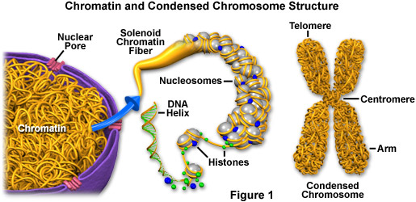

# Genetics

## Variation in Traits

**Traits** are any characteristics of an organism.

An organism's **genotype** is [the genetic makeup of the organism](#user-content-fn-1)[^1], but its **phenotype** would be the actual characteristics and behaviors the organism actually expresses. Both genetic _and_ environmental factors can influence the variation and distribution of traits.


If a person has dark skin but genetics tied to lighter skin, their skin may be affected by the environment. For example, the person may have gotten a tan from being in the sun too long.

Through this, we can also conclude that _phenotype isn't permanent but genotype is_.


## DNA Structure

**Deoxyribonucleic acid** (DNA) is a [double helix](#user-content-fn-2)[^2] consisting of two long strands that wind around each other. DNA is composed of a chain of nucleotides.

DNA is also **antiparallel**, meaning the ends of its strands are opposites. Each DNA strand has a 3' end and a 5' end, which is denoted by the order in which carbons of the sugars are placed. At the 3' end, there is hydroxyl (OH) and at the 5' end, there is a phosphate.

DNA's nucleotides each consist of a deoxyribose sugar, a phosphate group, and a nitrogenous base. The sugars and phosphates make up the **phosphate-sugar backbone**. DNA's nitrogenous bases are arranged so that each of the two strands' bases meet and are connected by hydrogen bonds.

### The Nitrogenous Bases of DNA

Nucleotides in DNA can have one of four different nitrogenous bases: **adenine**, **thymine**, **cytosine**, and **guanine**. Two complementary bases are called a **complementary base-pair**.

Adenine and thymine are complementary. When there is an adenine on one strand, there is a matching thymine on the other strand. Adenine and thymine bases are connected by _two_ hydrogen bonds.

Cytosine and guanine are complementary. When there is an cytosine on one strand, there is a matching guanine on the other strand. Cytosine and guanine bases are connected by _three_ hydrogen bonds.

<figure><figcaption>
<strong>Image 1</strong> — Different representations of the structure of DNA.
</figcaption></figure>

## DNA Replication

When DNA replicates, it is **semiconservative**. Instead of duplicating and staying attached, it splits the two strands apart and creates a complementary strand for each of the original strands. The two resulting DNA have one original strand each like shown in Image 2.

<figure><figcaption>
<strong>Image 2</strong> — DNA replication is semiconservative.
</figcaption></figure>

### Steps of DNA Replication



#### Splitting DNA

In order to replicate, DNA must split apart first. An enzyme called **helicase** breaks the hydrogen bonds between bases to separate the strands into a **replication fork** like in Image 3.

<figure><figcaption>
<strong>Image 3</strong> — A replication fork. The protein shown is helicase.
</figcaption></figure>

The strand that is cut starting at the 3' end is called the **leading strand template**. The strand cut at the 5' end is called the **lagging strand template**. The new DNA strands made complementary to these templates are the **leading strand** and **lagging strand** respectively.



#### Priming the Leading Strand

An enzyme called **Primase** adds a small sequence of RNA bases complementary to the leading strand template called a **primer**. This marks the starting point for the construction of the leading strand.



#### Constructing the Leading Strand

An enzyme called **DNA Polymerase** binds to the primer. DNA Polymerase can only add bases in one direction: from the 5' end to the 3' end.

On the leading strand template, the enzyme then adds new complementary DNA bases to construct the actual leading strand continuously whilst the helicase enzyme is still splitting the DNA strands apart like in Image 4.

<figure><figcaption>
<strong>Image 4</strong> — The creation of the leading strand on top by DNA Polymerase. Helicase, to the far left, is still splitting DNA as this goes on.
</figcaption></figure>




#### Priming and Constructing the Lagging Strand

Since the lagging strand template runs in the opposite direction, DNA Polymerase can't continuously create the lagging strand. It instead creates them in chunks called **Okazaki fragments**.

A primer is first created. Then, a short row of DNA bases are created in the 5' to 3' direction. Another primer is added further down and the process repeats like in Image 5.

<figure><figcaption>
<strong>Image 5</strong> — Primase priming the lagging strand. The gap is where the Okazaki fragment will be.
</figcaption></figure>




#### Cleaning Up and Resealing

An enzyme called **exonuclease** removes all the RNA primers from both of the new DNA strands. Then, DNA Polymerase fills in the gaps.

Finally, an enzyme called **DNA Ligase** seals both DNA strands up.



## Organization of DNA

A **genome** is an organism's complete set of genetic material. Different organisms have different genomes.

DNA is condensed into a structure called the **chromosome**. An organized package of DNA, chromosomes are how DNA can fit inside the nucleus of every cell.

Chromosomes are in an x-shape like in Image 6, with the center called the **centromere**, four **arms**, and four **telomeres**. When uncondensed, chromosomes are called **chromatin**.

<figure><figcaption>
<strong>Image 6</strong> — The structure of chromosomes.
</figcaption></figure>

The **karyotype** is an individual's collection of chromosomes.


Humans have a karyotype of 46 chromosomes.


**Genes** are sequences of DNA that encode for RNA and proteins. Different genes code for different proteins and some genes don't even have to code for proteins.

### DNA Arrangement

The area on the chromosome where a specific gene is located is called the **locus**.

All organisms have a set number of chromosomes in every cell, yet they are grouped into chromosome pairs. The two chromosomes of a pair are homologous, meaning each gene in both chromosomes code for the same purpose. This is why each chromosome pair is also called **homologous chromosomes**.

Formally, homologous chromosomes are a pair of chromosomes of the same length and pattern that possess genes for the same traits.

Homologous pairs are not identical, however. Though every gene on one chromosome in a homologous pair is matched with the corresponding gene of the other, they can have different variants of the gene. A variant of a gene is called an **allele**.


A homologous pair for a flower can have different alleles for the gene that heavily determines petal color. This means one of the chromosomes in the pair can code for white petals, but the other could code for purple petals.


When a homologous pair has a gene with the same allele, it is considered as **homozygous**. When a homologous pair has a gene with two different alleles, it is considered as **heterozygous**.

## The Central Dogma

### The Product of Genes

Genes' DNA codes for different proteins that can help provide structure and function to the organism. Despite this, only about 1.5% of genes code for proteins and RNA. The rest of the DNA _regulates_ **gene expression**, the process of going from DNA to a [functional product](#user-content-fn-3)[^3].

In order to actually get to proteins from DNA, there is a process requiring RNA.

<figure><figcaption>
<strong>Image 7</strong> — Comparison between RNA and DNA.
</figcaption></figure>

The major differences between RNA and DNA are that RNA is single-stranded and uses a different nitrogenous base in the place of thymine: **uracil**. Uracil is also complementary to adenine.

### Protein Synthesis

If you remember, proteins are created within the [ribosomes](cells.md#organelle-list) of a cell.

DNA, being long and complex, is to large to leave the nucleus as is. To transfer the gene outside of the nucleus, an RNA sequence is constructed for just the gene needed.

**Transcription** is the process in which mRNA is constructed from DNA. **Translation** is the process where mRNA codes for amino acids, which then chain into a protein.



#### Transcription

To start, the enzyme **RNA Polymerase** attaches onto the DNA where the gene is located. RNA Polymerase—like DNA Polymerase—can also only read from the 5' end to the 3' end. The strand that RNA Polymerase reads is called the **coding strand**. The other strand is called the **noncoding strand**.

RNA Polymerase then reads the coding strand and creates the RNA sequence complementary to the gene. This sequence of RNA is called **messenger RNA** (mRNA).

mRNA can now leave the nucleus in order to reach a ribosome.



#### Translation

Once mRNA reaches the ribosome, it feeds into it.

More RNA called **transfer RNA** (tRNA) reside within the cytoplasm. tRNA molecules read the mRNA strand in units called **codons**, which are snippets of _three consecutive_ nitrogenous bases.

A **start codon** tells the ribosome to start reading and translating the mRNA strand. A **stop codon** is a specific codon that tells the ribosome to stop reading and translating the mRNA.


Note that a ribosome won't start making a polypeptide chain until it reads a start codon. Conversely, it won't stop reading and release the mRNA until it reaches a stop codon.


<figure><figcaption>
<strong>Image 8</strong> — Amino acid codon wheel.
</figcaption></figure>

Each codon corresponds to a specific amino acid (or stop codon). The tRNA then takes the amino acid coding for the **anticodon** of the codon it read.


The anticodon is the set of three base pairs that is complementary to the codon.


The tRNA carries the amino acid over to the mRNA and places the first amino acid. The mRNA then feeds through and the next amino acids are placed by more tRNA. As codons are read and amino acids are chained, previously used tRNA detaches from the mRNA in order to be reused.

Once the ribosome reaches a stop codon (refer to Image 8), it releases the mRNA and **ribosomal RNA** (rRNA) inside the ribosome creates peptide bonds to fully connect the amino acids into a polypeptide chain.

The protein has now been created.



## Mutations

A **mutation** is a permanent change in the DNA sequence. This is done when there is a mistake in DNA replication, though external factors (like radiation) can also cause mutation.

### Insertion and Deletion

There are exactly as they seem; **insertion** adds a base to the sequance, while **deletion** removes a base from the sequence.

Because of the way they alter the DNA sequence, insertion and deletion are considered as **frameshift mutations**. These mutations completely change which amino acids are chained from the mutation and onward.

### Substitution

**Substitution** is when a base is switched for a different base. There are three types of substitution mutation...

**Silent substitution mutations** are when the mutation has no effect on the amino acid. This means that the correct amino acid is used and the protein still functions as normal.

**Missense substitution mutations** are when the mutation changes one amino acid into another. This changes a single amino acid in the sequence and can cause the protein to work differently or not function properly.

**Nonsense substitution mutations** are when the mutation changes the amino acid into a stop codon, prematurely ending the amino acid chain. This can cause proteins to not function properly.

### Mutations Transferring During Reproduction

Sometimes, a mutation may be present in a [**gamete**](#user-content-fn-4)[^4]. This mutation would then carry on to the offspring, when it fuses with the other gamete, making it highly likely that the offspring has the mutation. This is called a **germline mutation**.

If the mutation happens in any other cell, it is a **somatic mutation**, making it non-heritable.

## Epigenetics

**Epigenetics** is how cells control gene expressions [without changing the DNA](#user-content-fn-5)[^5].

A **promoter** is an area of DNA before a gene where RNA polymerase binds.


Do not confuse primers with promoters! A promoter is a _permanent_ part of the DNA strand, but a primer is _temporary_ and removed after use.


A **transcription factors** are proteins that helps turn specific genes on or off by binding to nearby DNA.

**Histones** are proteins that chromatin wraps around to ocndense into chromosomes.

Chromatin is open when it is loosely wrapped and can be accessed for transcription. Chromatin is closed when it is wrapped tightly around histones. This makes enzymes unable to use the DNA.

When transcription factors bind to chromatin, they can trigger the addition of **methyl groups**. This often serves as a chemical "lock" that stabilizes the closed state and makes the area unusable. The process of methylating DNA is called **DNA methylation**.

<figure><figcaption>
<strong>Image 9</strong> —How methyl factors work.
</figcaption></figure>

## The Cell Cycle

The goal of **cell division** is to make a copy of a cell in order to grow, repair damage, and reproduce[^6].

<figure><figcaption>
<strong>Image 10</strong> — The cell cycle and its phases.
</figcaption></figure>

### Interphase

During the cell cycle, the cell spends most of its time in **interphase**.



#### G1 Phase (Cell Growth)

During this phase, the cell undergoes normal growth and development.



#### S Phase (DNA Synthesis)

During this phase, the cell will [make copies of all the chromosomes](#user-content-fn-7)[^7]. This phase takes the most time during interphase. Additionally, the **centriole** also duplicates.

The centrosome is a small structure in the cell that can produce tubules called **spindle fibers**. They are essential in cell division.


Centrioles are only in animal cells.




#### G2 Phase (Cell Growth)

During this phase, the cell undergoes normal growth and development.



The cell then undergoes **mitosis** and **cytokinesis**, where it splits to form two **daughter cells**. Both daughter cells then start their cell cycle.


There are different checkpoints throughout the cell cycle that check for errors in the cell and stop the cell if there is a problem.

Certain cases can make cells bypass these checkpoints, which can cause diseases like cancer.


### Chromosomes and Chromatids

**Chromatids** are the individual DNA molecules that each hold a copy of DNA.

A **centromere** is the point where two **sister chromatids** are conjoined. See Image 10 above.


Chromosomes are counted by the number of centromeres, but chromatids are counted by the individual number of copies of the DNA. Thus—after replication—human cells after undergoing DNA synthesis will still have 46 chromosomes, but will have 96 individual chromatids.


## Mitosis

**Germline cells** are the gametes in your body. This consists of the **sperm** for males and the **ovum** (eggs) for females. **Somatic cells** are body cells. This includes every cell in your body except for germline cells.

Somatic cells undergo mitosis, while germline cells do not. Because somatic cells need to undergo mitosis, they have two sets of chromosomes. Cells that have two sets of chromosomes are called **diploid cells**.

<figure><figcaption>
<strong>Image 11</strong> — How chromosomes duplicate during the S Phase.
</figcaption></figure>

### The Stages of Mitosis

Multicellular organisms' cells undergo mitosis to perform growth and repair. In single-celled organisms, mitosis is performed for asexual reproduction.

<figure><figcaption>
<strong>Image 12</strong> — The steps of mitosis.
</figcaption></figure>

The steps of mitosis are as follows...



#### Prophase

In **prophase**, the chromosomes in the nucleus begin to compact into the classic x-shape. The nucleus begins to disappear and the the centrioles move to opposite sides of the cell.

The centrioles also start to create spindle fibers.



#### Metaphase

In **metaphase**, the nucleus is gone. The chromosomes line up directly in the center of cell in a row called the **metaphase plate**.

The spindle fibers begin to attach to the chromosomes.



#### Anaphase

In **anaphase**, the sister chromatids are pulled apart by the spindle fibers onto either side of the cell.



#### Telophase

In **telophase**, two nuclei begin to form around the chromosomes[^8]. The spindle fibers begin to disappear and cytokinesis starts.



### Cytokinesis

During telophase, cytokinesis begins, causing the cytoplasm to physically split into the two daughter cells. In the end, each daughter cell [has 46 chromosomes each](#user-content-fn-9)[^9] and a centriole each.

## Gene Cloning

**Gene cloning** is a technique used to create identical copies of a specific gene or segment of DNA.

### Recombinant DNA

Scientists looked to using bacteria to make insulin. In order to do this, scientists inserted the gene in humans for making insulin into a bacterial [**plasmid**](#user-content-fn-10)[^10] so that the bacteria will create the insulin.

A **restriction enzyme** is an enzyme that can splice DNA in specific areas.

<figure><figcaption>
<strong>Image 13</strong> — How recombinant DNA is formed.
</figcaption></figure>

When a sequence in DNA is removed and replaced with a different sequence, it is called **recombinant DNA**.

### Cell Differentiation

**Cell differentiation** is the process by which cells become specialized during development. All body cells have the same DNA, but cells can activate or deactivate different genes from other cells.

#### Specialized Cells

**Stem cells** are the body's raw materials—unspecialized cells capable of dividing and transforming into specific types of cells.

Stems cells are **pluripotent** if they can differentiate into any of the cell types in the body, _except_ the placenta. Stems cells are **unipotent** if they are restricted to producing only one specific cell type.

**Specialized cells** are the mature, [distinct building blocks](#user-content-fn-11)[^11] that have a fixed structure and perform dedicated, highly specific functions.

## Meiosis

A **zygote** is a fertilized egg cell that results from the union of a [female gamete](#user-content-fn-12)[^12] with a [male gamete](#user-content-fn-13)[^13], this process is called **fertilization**.

Each gamete has **haploid cells**, meaning they have only _one_ set of chromosomes. This is because when gametes combine, the zygote gets half its chromosomes from the egg and half from sperm.

<figure><figcaption>
<strong>Image 14</strong> — How gametes form a zygote.
</figcaption></figure>

**Meiosis** is different from mitosis as there are two divisions in meiosis. The steps of meiosis are broken down into two different portions; they are as follows...

<figure><figcaption>
<strong>Image 15</strong> — The steps of meiosis.
</figcaption></figure>

### Meiosis I

For the first division...



#### Prophase I

In **prophase I**, the chromosomes in the nucleus begin to compact into the classic x-shape. The nucleus begins to disappear and the the centrioles move to opposite sides of the cell.

The centrioles also start to create spindle fibers.

**Crossing over** may also happen, where homologous pairs exchange genetic information.



#### Metaphase I

In **metaphase I**, the nucleus is gone. The chromosomes line up in the center of cell, but do so in homologous pairs.

The spindle fibers begin to attach to the chromosomes.



#### Anaphase I

In **anaphase I**, the _homologous pairs_ are pulled apart by the spindle fibers onto either side of the cell.



#### Telophase I

In **telophase I**, two nuclei begin to form around the chromosomes[^8]. The spindle fibers begin to disappear and cytokinesis starts.



Cytokinesis then completes, creating two diploid daughter cells; each chromosome in each cell has two sister chromatids.

### Meiosis II

Now for the second round of division...



#### Prophase II

In **prophase II**, the chromosomes in the nucleus begin to compact into the classic x-shape. The nucleus begins to disappear and the the centrioles move to opposite sides of the cell.

The centrioles also start to create spindle fibers.

Crossing over does not happen in this phase.



#### Metaphase II

In **metaphase II**, the nucleus is gone. The chromosomes line up directly in the center of cell in a row.

The spindle fibers begin to attach to the chromosomes.



#### Anaphase II

In **anaphase II**, the sister chromatids are pulled apart by the spindle fibers onto either side of the cell.



#### Telophase II

In **telophase II**, nuclei begin to form around the chromosomes[^8]. The spindle fibers begin to disappear and cytokinesis starts.



Cytokinesis then completes, creating four haploid daughter cells. Meiosis is done and each haploid daughter cell is a gamete.

## Gender-Specific Meiosis

### Meiosis in Males

<figure><figcaption>
<strong>Image 16</strong> — The process of <strong>spermatogenesis</strong>. Spermatogenesis is production of sperm via meiosis. It produces four haploid sperm cells.
</figcaption></figure>

### Meiosis in Females

<figure><figcaption>
<strong>Image 17</strong> — The process of <strong>oogenesis</strong>. Oogenesis is the production of via meiosis. One functional egg and four useless polar bodies are produced from each meiotic process. This is because in oogenesis, the cytoplasm splits unevenly during cytokinesis.
</figcaption></figure>

## Variation in Traits

### Genetic Variation

#### Effect of Independent Assortment

The random orientation of homologous pairs in metaphase I allows for the production of gametes with many different assortments of homologous chromosomes.

<figure><figcaption>
<strong>Image 18</strong> — The effect of independent assortment on genetic variation.
</figcaption></figure>

#### Effect of Crossing Over

The combination of [shuffling genes](#user-content-fn-14)[^14] also ensures that each of the four gametes produced is unique.

<figure><figcaption>
<strong>Image 19</strong> — How crossing over (recombination) works.
</figcaption></figure>

### Heritable Variation

There are three ways this can happen...

* Mutations.
  * Errors in DNA replication due to environmental factors like radiation.
* New genetic combinations through meiosis.
  * Crossing over in Prophase I.
  * Independent assortment.
    * Random arrangement of chromosomes in Metaphase II.
* Possibility of any sperm fertilizing an egg.

### Genetic Diversity

**GDp** (Genetic Diversity of Populations) is measured with a number from 0 to 1 representing how much genetic variation exists across sampled genes in a population. The larger the number, the more genetic variation a population has.

#### Population Bottleneck

When a severe change happens to an environment, few may survive, resulting in a **population bottleneck**.

<figure><figcaption>
<strong>Image 20</strong> — A population bottleneck.
</figcaption></figure>

[^1]: The set of genes of the organism.

[^2]: Which resembles a twisted ladder.

[^3]: In most cases, it's a protein.

[^4]: A gamete is a reproductive cell of an organism. For humans, women have eggs and men have <mark style="color:red;">s</mark><mark style="color:orange;">p</mark><mark style="color:yellow;">e</mark><mark style="color:green;">r</mark><mark style="color:blue;">m</mark>.

[^5]: Without physically changing nucleotides (mutation).

[^6]: In the case of single-celled organisms.

[^7]: DNA is replicated.

[^8]: Formerly the chromatids; they are now considered as individual chromosomes because they each have a single centromere.

[^9]: And, thus, are also both diploid cells.

[^10]: A plasmid is a circular (connected at the ends), extra sequence of DNA that can easily be isolated and manipulated.

[^11]: Like neurons or muscle cells.

[^12]: An ovum, or egg.

[^13]: A sperm.

[^14]: Crossing over.
